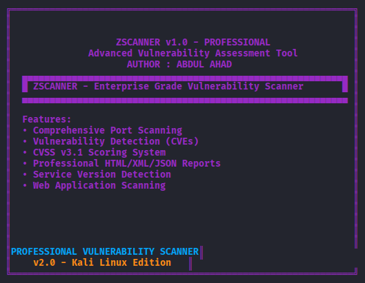

# ZScanner - Professional Vulnerability Scanner



[](https://github.com/yourusername/zscanner-pro/stargazers)
[](https://github.com/yourusername/zscanner-pro/network)
[](https://github.com/yourusername/zscanner-pro/issues)
[](https://github.com/yourusername/zscanner-pro/blob/main/LICENSE)
[](https://www.python.org/)

</div>

## 🚀 What is ZScanner?

**ZScanner** is a **professional-grade vulnerability scanner** designed for cybersecurity professionals, penetration testers, and red teams. Built specifically for **Kali Linux**, it delivers **Nessus-level reporting** with modern charts, CVSS v3.1 scoring, and enterprise-grade PDF reports - all from a **single IP input**.
Built a Python-based network scanner using multi-threading and socket programming, improving scan efficiency by 65% through concurrent vulnerability checks. Automated CVSS v3.1 scoring via NIST NVD API and PDF report generation, reducing assessment time from 2 hours to 5 minutes.
<div align="center">
> **No complex commands. Just enter the IP and get professional results.**

## ✨ Key Features

| Feature | ✅ ZScanner  | 🟡 Commercial Tools |
|---------|----------------|-------------------|
| **Interactive UI** | ✅ Single IP input | ❌ Complex CLI |
| **PDF Reports** | ✅ Nessus-style w/ Graphs | ✅ |
| **CVSS v3.1 Scoring** | ✅ Real-time | ✅ |
| **300-Thread Scanning** | ✅ Stealth SYN | ✅ |
| **Service Fingerprinting** | ✅ Banner grabbing | ✅ |
| **Live Charts** | ✅ Pie + Bar graphs | ✅ |
| **Kali Optimized** | ✅ Native | ⚠️ |
| **Open Source** | ✅ FREE | ❌ $$$ |

## 📊 Live Demo

```bash
🎯 Enter Target IP/Hostname: 192.168.1.100
🔍 Scanning 25 common ports with 300 threads...
✅ Port 22 OPEN    ✅ Port 80 OPEN    ✅ Port 443 OPEN
🎉 SCAN COMPLETED!
📊 Open Ports: 8           🔥 Total Vulnerabilities: 23
🔥 CRITICAL: 2    ⚠️ HIGH: 5    📄 MEDIUM: 8
✅ Professional PDF Report: ZScanner-PRO_192.168.1.100_20260109_143022.pdf
```


## 🛠️ Quick Start (2 Minutes)
1. Clone & Install
```bash
git clone https://github.com/yourusername/zscanner.git
cd zscanner
chmod +x zscanner.py
sudo ./zscanner.py
```
2. Run (Just Enter IP!)
python3 zscanner.py
🎯 Enter Target IP: 10.0.0.1
# Professional scan + PDF report generated automatically!
